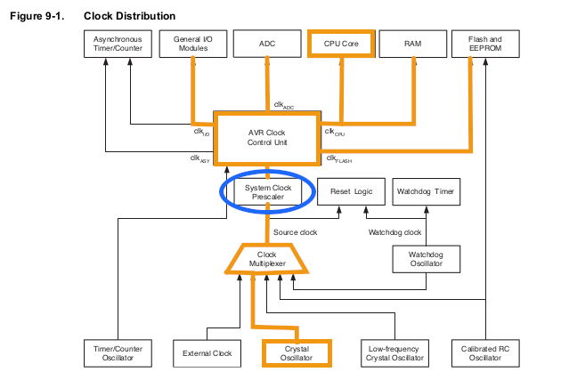
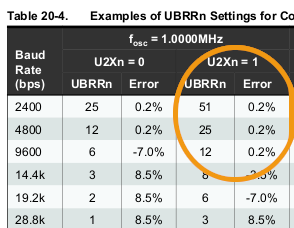

# Slow That Uno Down!
Use the System Clock Prescaler to reduce power consumption of an Arduino Uno or Nano by slowing the speed of its ATmega328P microcontroller.

It takes only two code instructions.

Modify the Baud Rate Generator to enable Serial communications at the slower clock speed.

That takes another two code instructions

A total of four code instructions achieves both of those desirable results. This article takes a Food-First-Then-Recipe approach. It:

* demonstrates the instructions, 
* locates and explains the documentation for them, 
* concludes with discussion of advantages and disadvantages for slower system clock speeds.

NOTE TO BEGINNERS: The Arduino IDE provides your code with pre-defined variable names for 87 different "registers" inside the microcontroller's memory.

Each register occupies one byte of memory, meaning it holds eight bits. Each bit is like a switch that turns things on and off inside the microcontroller. 

The bits determine everything that goes on in there.

For example, the "CLKPR" register discussed below names a memory location. The eight bits stored in CLKPR establish the system speed.

Your code can read from and write to CLKPR and most of the other registers by name, as if they were variables just like those you declare in your code.

It means your code can change how the Arduino works, just by assigning a value to a register.

Direct access to the registers unlocks many hidden, bonus capabilities of the Arduino. 

## The Clock Prescaler Register, CLKPR

Here is the code to slow the Arduino Uno down to a 1 MHz clock speed from its default of 16 MHz.

```
  uint8_t priorStatus = SREG;
  cli();

  CLKPR = 0x80;
  CLKPR = 0b0100;

  SREG = priorStatus;
  
```

#### Why does the code write to the CLKPR register twice in succession?
These two steps have to be executed sequentially within a *very* short time. 

The first write to CLKPR notifies the register that you want to write a value to it. ```0x80``` sets the "Clock Prescaler Change Enable" bit, getting the register ready to accept a subsequent value.

The second write then writes a value you choose.

The sequence must not be interrupted. As a precaution, the ```cli();``` instruction disables interrupts globally.

```cli();``` affects a bit in the controller's status register, SREG. Therefore, the code preserves the register's contents beforehand and restores them afterward.

#### What does the value ```0b0100``` mean?
In the words of the official datasheet, it "defines the division factor between the selected clock source and the internal system clock." ```0b0100``` translates into "divide by 16." 

#### Where is the documentation for this?
The best source is the official datasheet published by Microchip, the manufacturer of the ATmega328P microcontroller. You can download it for free from their web site at the following URL:

[https://ww1.microchip.com/downloads/aemDocuments/documents/MCU08/ProductDocuments/DataSheets/ATmega48A-PA-88A-PA-168A-PA-328-P-DS-DS40002061B.pdf](https://ww1.microchip.com/downloads/aemDocuments/documents/MCU08/ProductDocuments/DataSheets/ATmega48A-PA-88A-PA-168A-PA-328-P-DS-DS40002061B.pdf)

Refer to pages 45 through 47.

Exhibit 1 marks up a table borrowed from page 36 of the datasheet. The orange line highlights the default configuration of the ATmega328P as established by the Arduino IDE for the Uno and Nano boards.

<br>
**Exhibit 1** The ATmega328P Clock schematic

First, the Crystal Oscillator is selected as the Source Clock. This feeds a 16 MHz signal into the System Clock Prescaler. The CLKPR register controls what happens inside the Prescaler.

Arduino IDE by default configures CLKPR to "divide by 1", meaning the 16 MHz incoming signal passes through unchanged into the Clock Control Unit, thence the rest of the system.

```CLKPR = 0b0100;``` changes this to "divide by 16". The incoming 16 MHz signal from the crystal is reduced to a 1 MHz signal going out.

The whole system switches to the new clock speed. This includes the "General I/O Modules", which means it affects the Serial communications modules such as SPI, TWI (I2C) and USART (the ```Serial.print()``` component.)

We need to make one more change.

## The BAUD Rate Generator
The following instructions will enable an ATmega328P running at 1 MHz to use the ```Serial``` communications resource as implemented by the Arduino IDE.

```
  Serial.begin(9600);
  UBRR0H = 0;
  UBRR0L = 12;
```

UBRR0H and UBRR0L are registers belonging to the Universal Synchronous and Asynchronous serial Receiver and Transmitter built into the ATmega328P. That is, the USART.

First the code initializes the USART in the usual way. 9600 BAUD happens to be the fastest reliable data transmission speed when running the processor at 1 MHz. 

Data transmission speed is obtained by counting cycles of the System Clock. A slower System Clock obliges the USART to count fewer cycles for any given transmission speed. 

The USART BAUD Rate Registers, UBRR0H and UBRR0L, contain the number of cycles to count. "12" happens to be the right number for 9600 BAUD at 1 MHz. 

#### Where is the documentation for this?
Section 20, "USART0" on pages 179 - 204 of the datasheet explains everything in detail. I will point out the relevant parts of it for this example.

Start on page 204. The number of cycles to count is a 12-bit value that can range from 0 up to 4095, that is, from 0x000 through 0xfff. UBRR0H stores the upper four bits, zero in this case. UBRR0L stores the lower 8 bits, 0x0c = 12, in this example.

Where did "12" come from?

Visit page 196. Exhibit 2 shows a portion of Table 20-4. "12" was chosen because it corresponds to 9600 BAUD at 1 MHz when the "U2X" bit is set to 1. We look in that column because the Arduino instruction, ```Serial.begin()```, sets the U2X bit to 1.

<br>
**Exhibit 2** Excerpt from datasheet table 20-4

Why not choose some other value? Two reasons:

* Those having "Error" much above 2% or below −2% should be avoided as unreliable.
* 9600 is the fastest transmission rate available with a 1 MHz System Clock.


## Advantages
Slowing the System Clock speed greatly reduces the power consumption of the ATmega328P controller on an Arduino.

The Arduino Uno normally runs at a clock speed equal to the 16 MHz frequency of the crystal oscillator mounted on the board.

The '328 burns nearly 10 milliAmps of current at 16 MHz. A program can reduce the current below one milliAmp by changing the clock speed. 

The following two, familiar-looking "Blinky" programs will perform almost the same, but one of them uses much less current.

### Try it!

#### Program #1, runs at 16 MHz 


```
/*
 * 16 MHz program draws nearly 10 mA of power
 */

void setup()
{
  pinMode(LED_BUILTIN, OUTPUT);
}

void loop()
{
  digitalWrite(LED_BUILTiN, HIGH);
  delay(1000);
  digitalWrite(LED_BUILTIN, LOW);
  delay(1000);
}
```

#### Program #2, runs at 1 MHz

```
/*
 * 1 MHz program draws about 1 mA of power
 */

void setup()
{
  uint8_t priorStatus = SREG;  // preserve system status
  cli();                       // disable interrupts globally
  CLKPR = 0x80;                // enable changing clock prescale register
  CLKPR = 0b0100;              // divide by 16 gives 1 MHz system clock
  SREG = priorStatus;          // restore prior system status
  
  pinMode(LED_BUILTIN, OUTPUT);
}

void loop()
{
  digitalWrite(LED_BUILTiN, HIGH);
  delay(1000 / 16);
  digitalWrite(LED_BUILTIN, LOW);
  delay(1000 / 16);
}
```

Supply a well-regulated 5 volts directly to the "5V" header of the Arduino Uno. Measure the current going in.

Program #1, the classic "Blink" example, draws a bit over 46 mA of current that way.

By contrast, Program #2 reduces the draw to around 38 mA. 

Reducing clock speed is the easiest trick we have for conserving power with an Arduino Uno. But is the difference between 38 and 46 really significant?

Yes, very much so, when you take the '328 off the Arduino and mount it by itself in a circuit, the way it was designed to be used. Then the comparison is of 1 mA to 9 mA. 

Don't take my word for it. Consult the datasheet, available from Microchip, the '328's manufacturer, [here](https://ww1.microchip.com/downloads/aemDocuments/documents/MCU08/ProductDocuments/DataSheets/ATmega48A-PA-88A-PA-168A-PA-328-P-DS-DS40002061B.pdf).

Study Figures 31-332 and 31-333 on pages 501 and 502. The graphs display the power usage at 5 volts for 1 MHz and 10 MHZ, respectively.

Put the difference into perspective in terms of battery life. Suppose a battery of 5 volts, more or less, having useful capacity of 2,000 mAH. 

The Arduino running at 16 MHz would deplete the battery in less than 2 days.

Take the '328 off the Arduino and run it at 1 MHz. Now the battery could last 83 days.

Slowing the System Clock is an easy trick that addresses a difficult problem: how to run an "Arduino" project for a long time on batteries.

## Disadvantages

The Serial modules, SPI, TWI (I2C) and USART, communicate by sending and receiving pulses at timed intervals. The intervals are determined with reference to the System Clock. 

Holding all else equal, a slower system clock speed may constrain the speed of data transmission with all three of these modules.

The table below lists the maximum useful speeds for the three Serial modules when the System Clock speed is 1 MHz. The value given for TWI was calculated from the datasheet then verified with an oscilloscope.

| Module | Max Speed | Remarks |
| === | === | === |
| USART | 9600 Baud | Table 20-4 |
| TWI | 62.5 KHz | Calculated and measured |
| SPI | 250 KHz | Calculated (1) |

(1) The datasheet states that SPI is not assured of working in a clock-receiver role if the speed exceeds 1/4th of the System Clock speed.

Only you can decide whether one of those speeds can satisfy requirements for your project.

Another possible disadvantage could show up as perceptibly slower execution of lengthy procedures. Careful code design may be able to mitigate this consideration somewhat.

1 MHz may sound ancient and slow compared to specs for snazzy new processors coming out in the mid-2020s. Yet, a '328 executes nearly one million machine instructions per second at that speed. 

Consider that the entire flash memory of a '328 can hold at most about 16,000 instructions, plenty for most purposes. Running at 1 MHz a '328 could race through every instruction it could possibly contain 62 times in a second. Even you, Dear Reader, cannot blink that fast.

1 MHz could be abundant speed for many purposes. It might be worth a try.
